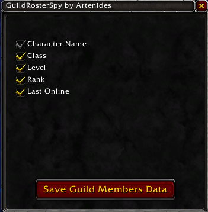

# WoW-Addons by Artenides

[A magyar nyelvű instrukciókért görgess lentebb (for the instructions in Hungarian please scroll down)]

## Guild Roster Spy

### Description
A lightweight addon to export data about the members of a guild.

### How to use it
```
1. Download the repository and move the GuildRosterSpy folder to your Addons folder 
(World of Warcraft\_retail_\Interface\AddOns\).

2. Start the game and enable the addon.

3. When you enter the game you should see the following panel:<br/>
```

```
4. Select what would you like to export and click Save.

5. Logout from the game (this will trigger the WoW client to dump the data into a file)

6. Go to World of Warcraft\_retail_\WTF\Account\youraccount\SavedVariables\ and open the GuildRosterSpy.lua file with a text editor.

7. Copy everything between CollectedData = { and the closing } and paste this into a new file. The content of the new file will look something like:

"Artenides-Arathor,MAGE,60,Member,0", -- [1]
	"Biomic-Arathor,DEATHKNIGHT,60,Officer Alt,107", -- [2]
	"Lyoris-Arathor,DEMONHUNTER,60,Officer Alt,22", -- [3]
	"Rysen-Hellfire,MAGE,50,Officer,0", -- [4]
	"Kieran-Arathor,WARLOCK,60,Officer,0", -- [5]
	"Viridum-Arathor,DEMONHUNTER,60,Officer,9", -- [6]
	"Intuicioo-Arathor,DRUID,60,Guild Master,0", -- [7]
  
8. Replace all quotes (") with empty then save the file as data.csv
9. You can open this csv file with Excel or Import it into a Google Spreadsheet.
```
